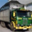
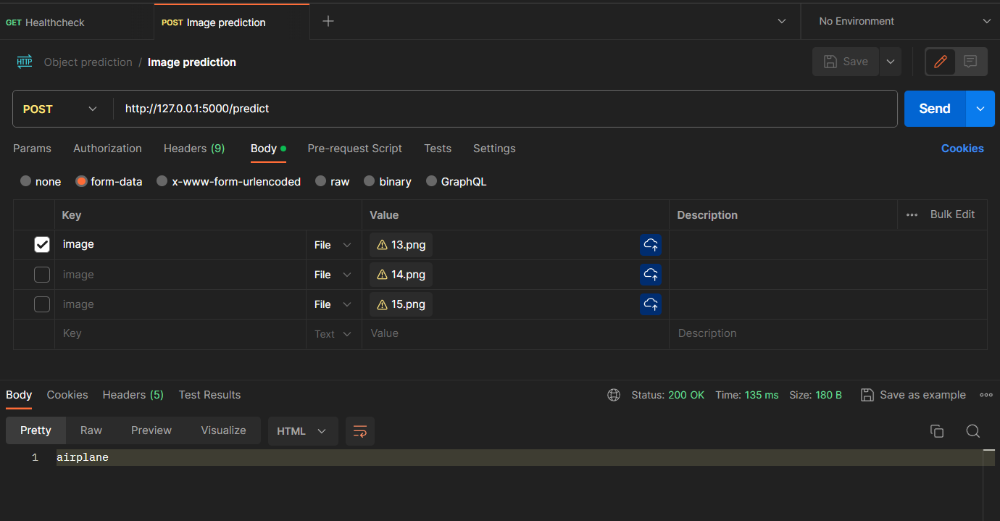
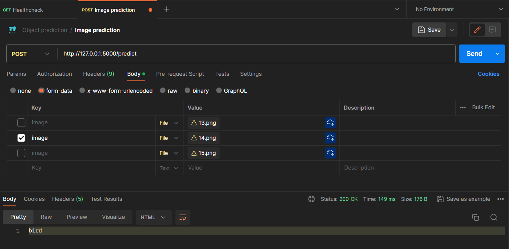
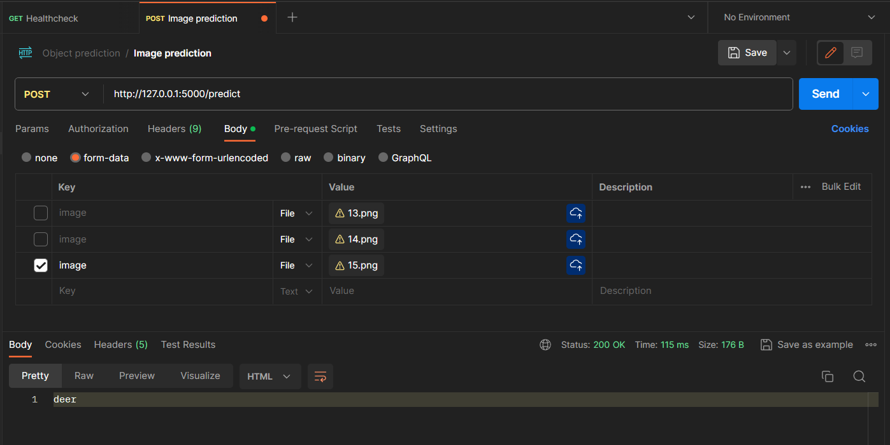

# Atividade: Classificação de Imagens (CIFAR-10)

Giovana Thomé - Ciência da Computação 2022.1 - Inteli

## Modelo

O modelo foi implementado em um ambiente do Google Colaboratory, podendo ser acessado [pelo link](https://colab.research.google.com/drive/1XdJRL_QF0Gyb_bCkFBPpwR-Sel2svFBK?usp=sharing) ou também no [object_detection.ipynb](./object_recognizer.ipynb).

Um arquivo `.pth` foi gerado também com o modelo treinado, que é utilizado pelo API para fazer as predições com o envio de imagens por requisições. O código fonte da API pode ser visualizado no arquivo [api.py](./api.py) e o arquivo está localizado [aqui](./cifar10_model2024-05-27%2001_13_44.746601.pth).

## Requisições

Foram feitos três casos de teste com requisições via Postman com as seguintes imagens:

Cavalo:

Pássaro:

Caminhão:

Cavalo, pássaro e caminhão, respectivamente. A imagem é passada no corpo da requisição com a chave `image`. O modelo não foi capaz de predizer com exatidão as categorias das imagens, tendo como resultados:

A API está funcional, porém o modelo requer melhoras em seu treinamento. O gráfico de acurácia pode ser visualizado em [object_detection.ipynb](./object_recognizer.ipynb)
